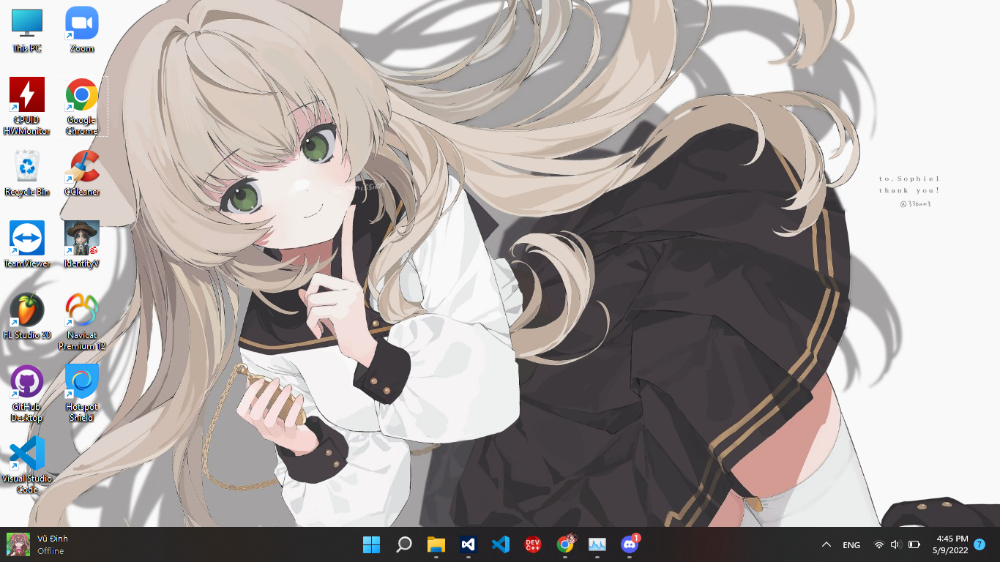

# FacebookWidget

**FacebookWidget** is a widget tool that shows a small widget with the active status and unread messages of a Facebook user on the taskbar.

<br>
*[The widget is shown on the bottom left of the image (a.k.a the left of the taskbar).]*

## Requirements
* [.NET Framework 4.5](https://dotnet.microsoft.com/en-us/download/dotnet-framework/thank-you/net45-web-installer)
* **Visual Studio 2012** or higher (for source code editing)

## Dependencies
* [HTMLAgilityPack](https://www.nuget.org/packages/HtmlAgilityPack) version 1.11.45

## How to use?
* **Step 1:** Build the application from the source code, or download the pre-built application from [the Release section](./releases).
* **Step 2:** Create a file called `Config.ini` in the same folder as the executable file (`FacebookWidget.exe`) like this example, with the parameters explained on the table below the code:

```ini
[Config]
ID=
Cookie=
Position=
XOffset=
YOffset=
FontName=
FontSize=
NameColor=
StatusColor=
Width=
Height=
TransparencyKey=
```

| Property | Type | Description |
| -------- | ---- | ----------- |
| `ID` | `string` | The Facebook ID that you want to get the information.
| `Cookie` | `string` | Your additional Facebook cookie data to be able to get the active status and unread messages. If undefined, the status section will display `Active status unavailable`. |
| `Position` | `string` | The position of the widget. Must be one of these positions: `UpperLeft`, `UpperRight`, `LowerLeft` or `LowerRight`. |
| `XOffset` | `int` | The X offset of the widget position. If the position is `XXXLeft`, the widget will move to the right. If the position is `XXXRight`, the widget will move to the left. |
| `YOffset` | `int` | The Y offset of the widget position. If the position is `UpperXXX`, the widget will move to the bottom. If the position is `LowerXXX`, the widget will move to the top. |
| `FontName` | `string` | The font name of the widget. |
| `FontSize` | `int` | The font size of the widget (as `point/pt`) |
| `NameColor` | `string` | The color of the Display Name text section. You can get the color names from [this website](http://www.flounder.com/csharp_color_table.htm). |
| `StatusColor` | `string` | The color of the Status text section. You can get the color names from [this website](http://www.flounder.com/csharp_color_table.htm). |
| `Width` | `int` | The width of the widget box (as `pixel/px`). |
| `Height` | `int` | The width of the widget box (as `pixel/px`). |
| `TransparencyKey` | `string` | The transparency key color of the widget (for better font rendering). |

If you don't want to configure this application yourself, there are some presets on the `Presets` folder of the pre-built application. Just copy one of them to the executable folder, rename it to `Config.ini` and edit the ID and cookie of that file.

### About the cookies

Facebook cookies are actually *not required* by this application, but if you want to get the active status and unread messages, or you need to display an user that can't be visited by a non-logged-in user, you need to provide it in the `Cookie` parameter of the config file.

**\* Disclaimer:** This application sends the cookie directly to the Facebook "API", and it doesn't collect any of your information. You can review the source code and build it manually before providing your cookie.

**How to get the cookies?**

* **Step 1:** Visit the **Facebook** website.
* **Step 2:** Open the **Developer Tools** by clicking `F12` or `Ctrl + Shift + I`.
* **Step 3:** Switch to the `Network` tab of the Developer Tools and refresh the page.
* **Step 4:** At the first request of that section (request to `www.facebook.com`), click in the request.
* **Step 5:** On the right of the window, scroll down to the `Request Headers` part and you will see the `Cookie` header. You just need to copy its value and done.

The copied cookies will look like this:

```
sb=XXXXXXXXXXXXXXXXXX; datr=XXXXXXXXXXXXXXXXXXXX; dpr=XXXXXXXXXXXXXXXX; wd=XXXXXXXX; locale=XXXXX; c_user=XXXXXXXXXXXXXXX; xs=XXXXXXXXXX; fr=XXXXXXXXXXXX; presence=XXXXXXXXXXXX
```

* **Step 6:** Paste it to the `Cookie` parameter of the config file, and save the file.

## Building

If you don't trust the pre-built application, you can manually build it.

* **Step 1:** Clone this repository, and open the `FacebookWidget.csproj` file using your Visual Studio.
* **Step 2:** On the opened project, just change it into your needing in any ways you want.
* **Step 3:** Change the `Build Type` to `Debug` or `Release` according to your needing.
* **Step 4:** Build this project. The built application will be in the `bin` folder of the opened project.

## Known bugs

* Sometimes it maybe unable to retrieve the data even you have provided the correct cookies. This can be Facebook's fault because the structure of the profile page is different for each user, or your account may be temporarily restricted because of spamming. You can try again after some hours or report that bug to this application's developer.
* The widget disappears when focusing on taskbar or clicking the `Show Desktop` button. This is Windows' restriction and I will find a way to fix it later.

## Contacting the developer

You can contact me at the `Social Networks` section of [my profile](https://www.github.com/NozakiYuu).

**Have fun using this application!**
